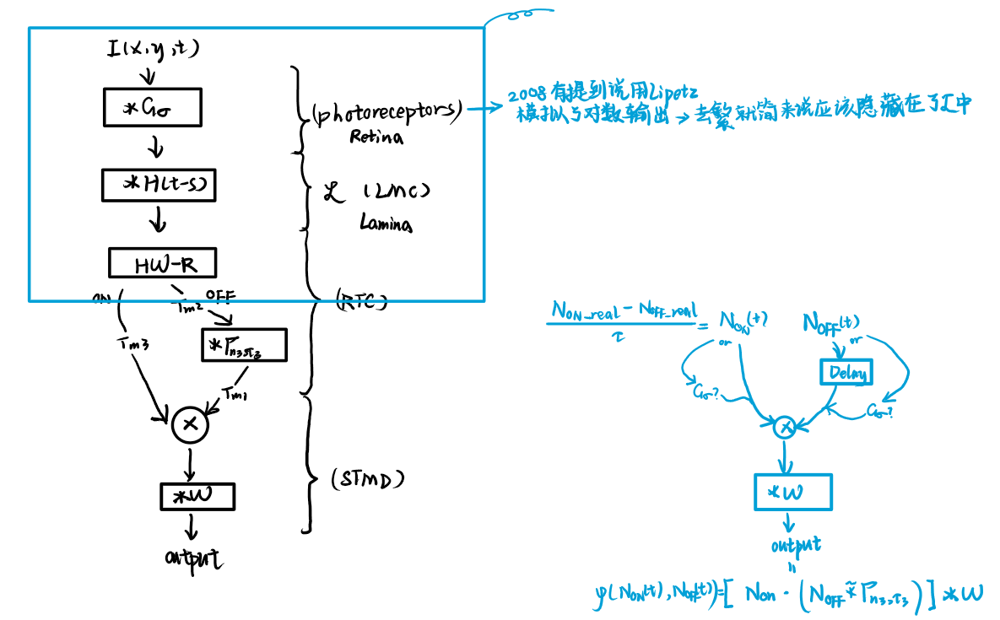

This is a sample blog post. Lorem ipsum I can't remember the rest of lorem ipsum and don't have an internet connection right now. Testing testing testing this blog post. Blog posts are cool.

Headings are cool
======

You can have many headings
======

Aren't headings cool?
------

此文仅用于Event_STMD的初步推导，兼具简单与丑陋的特点

# CH1:空间分辨率和时间分辨率Matters?
由于小目标的尺寸较小，可以把小目标的运动看作一条空间曲线$u(x(t),y(t),t)$。如下图所示。而对于收集到的离散数据则以pixel为单位估计实际物体位置i.e.$\hat{I}(x(t),y(t),t)$

  
  
数据分辨率与小目标运动

若设$(x_i(t),y_i(t),t)$为离$(x(u(t)),y(u(t)),t)$比较近的像素坐标。则估计误差可表达为

$$
\begin{aligned}

Error(I,\hat{I})&=\int_{0}^{T} \left| I(x(u(t)),y(u(t)),t) - \hat{I}(x(t),y(t),t)\right|dt
\\
\text{\tiny{传感器会使用周围像素"分辨"目标}}&=\int_{0}^{T} \left| I(x(u(t)),y(u(t)),t) - \sum _{i=1}^{M} w_i \cdot I(x_i(t),y_i(t),t)\right|dt
\\
\overset{\text{\tiny{实际上无法收集每个t的切片}}}{\underset{\text{\tiny{因此会用帧时刻进行估计}}}{}}&=\sum^N_{j=1}\int_{t_j}^{t_j+\Delta T}  \left| I(x(u(t)),y(u(t)),t) - \sum _{i=1}^{M} w_i \cdot I(x_i(t),y_i(t),t_j)\right|dt
\\
&= \sum^N_{j=1}\int_{t_j}^{t_j+\Delta T}  \left| \sum _{i=1}^{M} w_i \cdot \left[ I(x(u(t)),y(u(t)),t) -  I(x_i(t),y_i(t),t_j) \right] \right|dt
\\
\overset{\text{\tiny{taylor}}}{\underset{\text{\tiny{并且注意到}}\sum w_i=1}{}}&=\int_{t_j}^{t_j+\Delta T} \left| I_x(x(u(t)),y(u(t)),t)\cdot \sum _{i=1}^{M} w_i \Delta x_i+I_y(x(u(t)),y(u(t)),t)\cdot \sum _{i=1}^{M} w_i \Delta y_i+I_t(x(u(t)),y(u(t)),t)\cdot \Delta t_j + o(\sqrt{\Delta x_i^2+\Delta y_i^2+\Delta t_j^2})\right|dt
\\
&\leq\int_{t_j}^{t_j+\Delta T} \left| I_x(x(u(t)),y(u(t)),t)\cdot \sum _{i=1}^{M} w_i \Delta x_i \right|+\left|I_y(x(u(t)),y(u(t)),t)\cdot \sum _{i=1}^{M} w_i \Delta y_i\right|+\left|I_t(x(u(t)),y(u(t)),t)\cdot \Delta t_j\right| + \left|o(\sqrt{\Delta x_i^2+\Delta y_i^2+\Delta t_j^2})\right|dt
\end{aligned}
\\
where \quad w_i=\frac{S_i}{S}\text{为权重罢了} \quad and \quad 1=\sum _{i=1}^{M} w_i \\
\Delta x_i\triangleq x(u(t))-x_i(u(t)) \\
\Delta y_i\triangleq y(u(t))-y_i(u(t)) \\
\Delta t_j\triangleq t-t_j
$$
## Spatial Resolution Matters?
所以接下来我们obviously会考虑空间分辨率spatial resolution是否能suppress $\sum_{i=1}^{M} w_i \Delta x_i=\sum_{i=1}^{M} w_i(x-x_i)$

实际上像素间隔 $\Delta x$会限制住$\Delta x_i$,甚至我们考虑目标Object半径 $D(Object)$都会有:
$$
\begin{aligned}
D(Object)&<const \cdot \Delta x
\\
\sum_{i=1}^{M} w_i(x-x_i)&\leq \sum_{i=1}^{M} w_i(const \cdot \Delta x+\Delta x)=\Delta x \cdot (const+1)
\end{aligned}
$$
$ \sum_{i=1}^{M} w_i \Delta y_i$ 同理。因此我们得到结论`提高空间分辨率->降低像素间隔->提高小目标"分辨"能力`

## Temporal Resolution Matters?
而对于时间分辨率temporal resolution:
$$
\begin{aligned}
\sum^N_{j=1}\int_{t_j}^{t_j+\Delta T} \left|I_t(x(u(t)),y(u(t)),t)\cdot \Delta t_j\right| dt&\triangleq \sum^N_{j=1}\int_{t_j}^{t_j+\Delta T} \left|I_t(x(u(t)),y(u(t)),t)\cdot (t-t_j)\right| dt
\\
\overset{\text{\tiny{Cauchy-Schwarz}}}{\underset{\text{\tiny{Inequality}}}{}}&\leq \sum^N_{j=1}\sqrt{\int_{t_j}^{t_j+\Delta T} I_t^2(x(u(t)),y(u(t)),t)dt\int_{t_j}^{t_j+\Delta T}(t-t_j)^2 dt}
\\
&= \sum^N_{j=1}\sqrt{\int_{t_j}^{t_j+\Delta T} I_t^2(x(u(t)),y(u(t)),t)dt\int_{t_j}^{t_j+\Delta T}(t-t_j)^2 dt}
\\
&= \sum^N_{j=1}\sqrt{\int_{t_j}^{t_j+\Delta T} I_t^2(x(u(t)),y(u(t)),t)dt}\sqrt{\frac13(t-t_j)^3 \bigg|^{t_j+\Delta T}_{t_jt_j} }
\\
&= \frac{1}{\sqrt3}\Delta T^\frac32\sum^N_{j=1}\sqrt{\int_{t_j}^{t_j+\Delta T} I_t^2(x(u(t)),y(u(t)),t)dt}
\\
注意到\sqrt{I_i}&\leq max(I_i,1)\leq I_i+1
\\
即\sum^N\sqrt{I_i}&\leq\sum^N I_i +N
\\
\therefore原式&= \frac{1}{\sqrt3}\Delta T^\frac32\sum^N_{j=1}\sqrt{\int_{t_j}^{t_j+\Delta T} I_t^2(x(u(t)),y(u(t)),t)dt}
\\
&\leq \frac{1}{\sqrt3}\Delta T^\frac32 \Bigg( \sum^N_{j=1}\int_{t_j}^{t_j+\Delta T} I_t^2(x(u(t)),y(u(t)),t)dt+N \Bigg)
\\
&= \frac{1}{\sqrt3}\Delta T^\frac32 \Bigg( \int_{0}^{T} I_t^2(x(u(t)),y(u(t)),t)dt+\frac{T}{\Delta T} \Bigg)
\\
&= \frac{1}{\sqrt3}\Delta T^\frac32 \int_{0}^{T} I_t^2(x(u(t)),y(u(t)),t)dt+ \frac{1}{\sqrt3}\Delta T^\frac12 \cdot T
\\
&= \frac{1}{\sqrt3}\Delta T^\frac32 \cdot const+ \frac{1}{\sqrt3}\Delta T^\frac12 \cdot T
\end{aligned}
$$
其中$\Delta T$为时间采样间隔，提高时间分辨率以降低$\Delta T$。因此我们得到结论`提高时间分辨率->降低时间采样间隔->提高小目标"分辨"能力`。

# CH2:Event_STMD
事件相机为我们带来了很多好处，其中比较关键的是`异步性`,`高时间分辨率`,`高动态范围`。因此基于其数据格式，我们给出以下模型的改进，如下图所示(蓝色部分)(直接把原模型上半身去掉，并接入Event格式的数据)。

尽管这种改进实际上很"显然",也很简单。但这种改进确实实现了STMD的异步化和理论性能上限的突破。
## 行波Traveling wave still satisfy?
