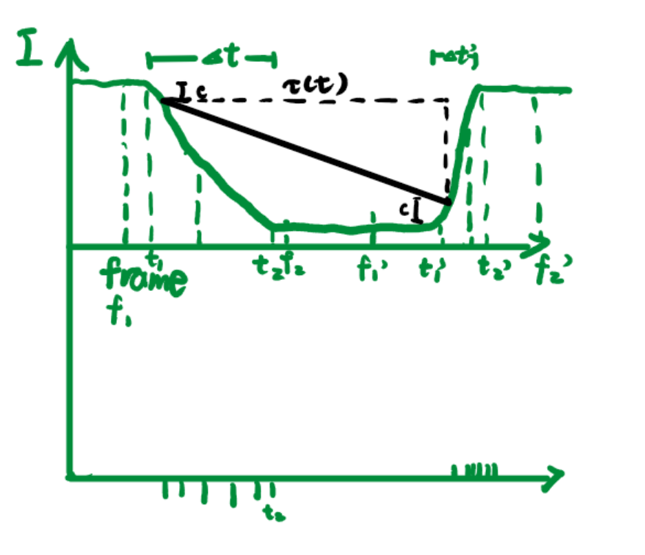

此文仅用于Event_STMD的初步推导，兼具简单与丑陋的特点

---

# 引入:空间分辨率和时间分辨率Matters?
由于小目标的尺寸较小，可以把小目标的运动看作一条空间曲线$u(x(t),y(t),t)$。如下图所示。而对于收集到的离散数据则以pixel为单位估计实际物体位置i.e.$\hat{I}(x(t),y(t),t)$

若设$(x_i(t),y_i(t),t)$为离$(x(u(t)),y(u(t)),t)$比较近的像素坐标。则估计误差可表达为

$$
\begin{aligned}

Error(I,\hat{I})&=\int_{0}^{T} \left| I(x(u(t)),y(u(t)),t) - \hat{I}(x(t),y(t),t)\right|dt
\\
\text{\tiny{传感器会使用周围像素"分辨"目标}}&=\int_{0}^{T} \left| I(x(u(t)),y(u(t)),t) - \sum _{i=1}^{M} w_i \cdot I(x_i(t),y_i(t),t)\right|dt
\\
\overset{\text{\tiny{实际上无法收集每个t的切片}}}{\underset{\text{\tiny{因此会用帧时刻进行估计}}}{}}&=\sum^N_{j=1}\int_{t_j}^{t_j+\Delta T}  \left| I(x(u(t)),y(u(t)),t) - \sum _{i=1}^{M} w_i \cdot I(x_i(t),y_i(t),t_j)\right|dt
\\
&= \sum^N_{j=1}\int_{t_j}^{t_j+\Delta T}  \left| \sum _{i=1}^{M} w_i \cdot \left[ I(x(u(t)),y(u(t)),t) -  I(x_i(t),y_i(t),t_j) \right] \right|dt
\\
\overset{\text{\tiny{taylor}}}{\underset{\text{\tiny{并且注意到}}\sum w_i=1}{}}&=\int_{t_j}^{t_j+\Delta T} \left| I_x(x(u(t)),y(u(t)),t)\cdot \sum _{i=1}^{M} w_i \Delta x_i+I_y(x(u(t)),y(u(t)),t)\cdot \sum _{i=1}^{M} w_i \Delta y_i+I_t(x(u(t)),y(u(t)),t)\cdot \Delta t_j + o(\sqrt{\Delta x_i^2+\Delta y_i^2+\Delta t_j^2})\right|dt
\\
&\leq\int_{t_j}^{t_j+\Delta T} \left| I_x(x(u(t)),y(u(t)),t)\cdot \sum _{i=1}^{M} w_i \Delta x_i \right|+\left|I_y(x(u(t)),y(u(t)),t)\cdot \sum _{i=1}^{M} w_i \Delta y_i\right|+\left|I_t(x(u(t)),y(u(t)),t)\cdot \Delta t_j\right| + \left|o(\sqrt{\Delta x_i^2+\Delta y_i^2+\Delta t_j^2})\right|dt
\end{aligned}
\\
where \quad w_i=\frac{S_i}{S}\text{为权重罢了} \quad and \quad 1=\sum _{i=1}^{M} w_i \\
\Delta x_i\triangleq x(u(t))-x_i(u(t)) \\
\Delta y_i\triangleq y(u(t))-y_i(u(t)) \\
\Delta t_j\triangleq t-t_j
$$
空间分辨率spatial resolution是否能

# Event_STMD基本框架
[在此处填写背景知识，为读者提供必要的理论基础]

# Methodology
## Mathematical Formulation
[在此处填写数学公式，例如：]
$$
f(x) = \int_{-\infty}^{\infty} \hat{f}(\xi) e^{2 \pi i \xi x} d\xi
$$

## Algorithm Description
[在此处填写算法描述，详细说明方法的实现步骤]

# Results
[在此处填写实验结果，可以使用图表和数据分析来支持结论]

# Discussion
[在此处填写讨论内容，分析结果的意义，并与已有研究进行比较]

# Conclusion
[在此处填写结论，总结文章的主要发现和贡献]

# References
[在此处填写参考文献列表]