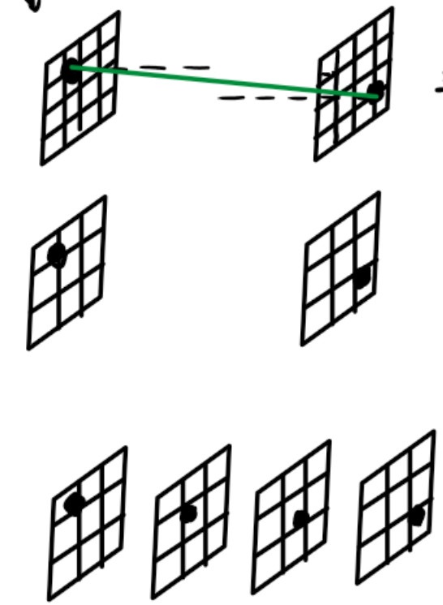
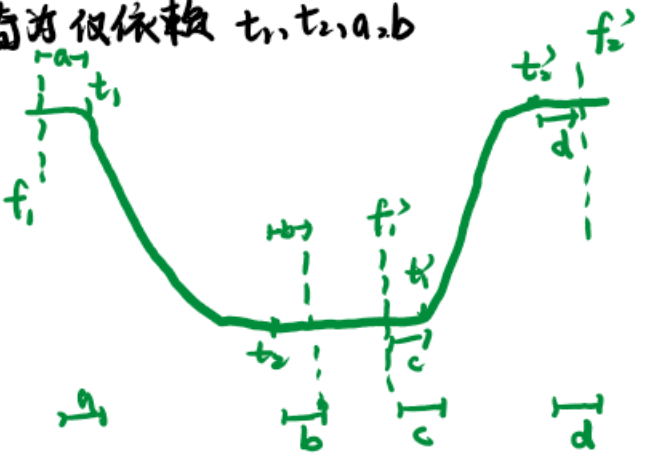
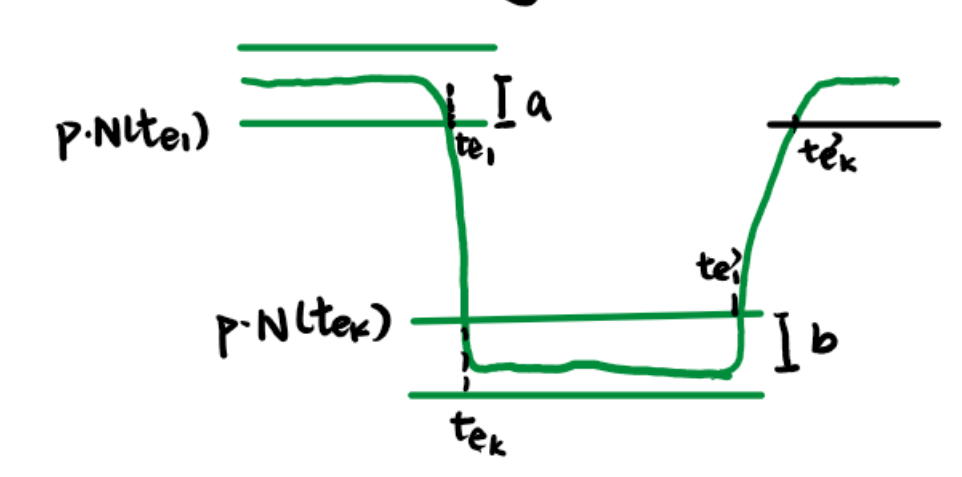
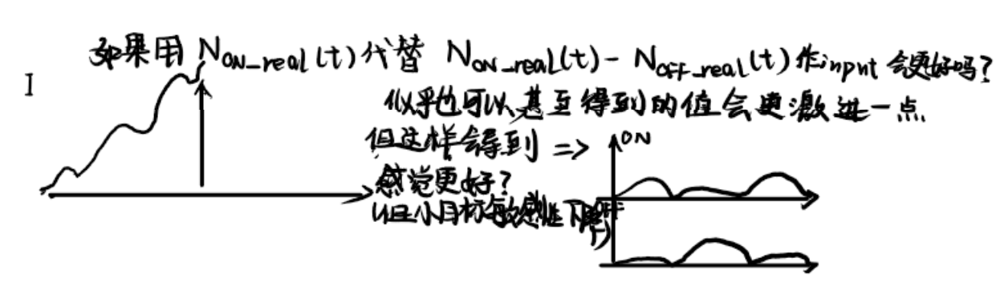
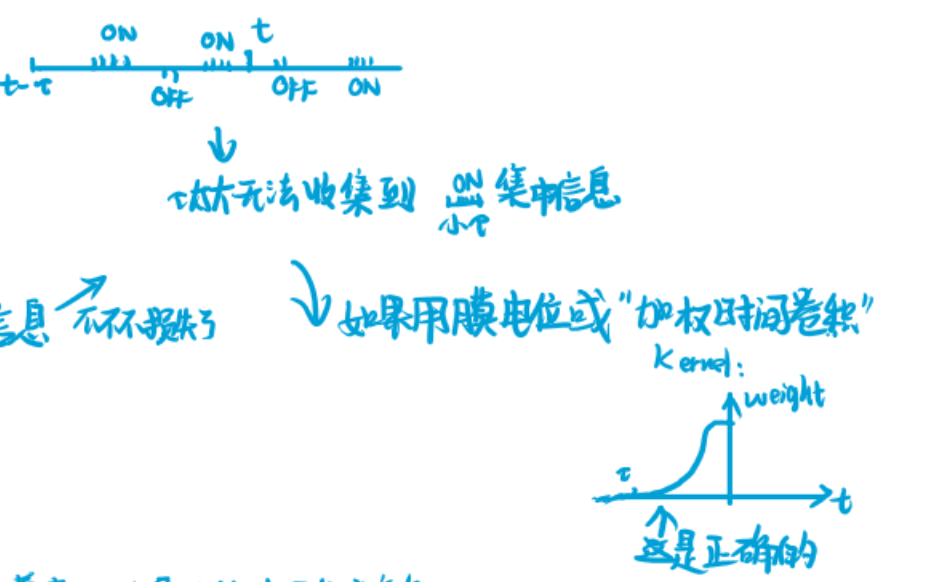

此文仅用于Event_STMD的初步推导，兼具简单与丑陋的特点


# CH1:空间分辨率和时间分辨率Matters?
由于小目标的尺寸较小，可以把小目标的运动看作一条空间曲线$u(x(t),y(t),t)$。如下图所示。而对于收集到的离散数据则以pixel为单位估计实际物体位置i.e.$\hat{I}(x(t),y(t),t)$



若设$(x_i(t),y_i(t),t)$为离$(x(u(t)),y(u(t)),t)$比较近的像素坐标。则估计误差可表达为

$$
\begin{aligned}

Error(I,\hat{I})&=\int_{0}^{T} \left| I(x(u(t)),y(u(t)),t) - \hat{I}(x(t),y(t),t)\right|dt
\\
\text{\tiny{传感器会使用周围像素"分辨"目标}}&=\int_{0}^{T} \left| I(x(u(t)),y(u(t)),t) - \sum _{i=1}^{M} w_i \cdot I(x_i(t),y_i(t),t)\right|dt
\\
\overset{\text{\tiny{实际上无法收集每个t的切片}}}{\underset{\text{\tiny{因此会用帧时刻进行估计}}}{}}&=\sum^N_{j=1}\int_{t_j}^{t_j+\Delta T}  \left| I(x(u(t)),y(u(t)),t) - \sum _{i=1}^{M} w_i \cdot I(x_i(t),y_i(t),t_j)\right|dt
\\
&= \sum^N_{j=1}\int_{t_j}^{t_j+\Delta T}  \left| \sum _{i=1}^{M} w_i \cdot \left[ I(x(u(t)),y(u(t)),t) -  I(x_i(t),y_i(t),t_j) \right] \right|dt
\\
\overset{\text{\tiny{taylor}}}{\underset{\text{\tiny{并且注意到}}\sum w_i=1}{}}&=\int_{t_j}^{t_j+\Delta T} \left| I_x(x(u(t)),y(u(t)),t)\cdot \sum _{i=1}^{M} w_i \Delta x_i+I_y(x(u(t)),y(u(t)),t)\cdot \sum _{i=1}^{M} w_i \Delta y_i+I_t(x(u(t)),y(u(t)),t)\cdot \Delta t_j + o(\sqrt{\Delta x_i^2+\Delta y_i^2+\Delta t_j^2})\right|dt
\\
&\leq\int_{t_j}^{t_j+\Delta T} \left| I_x(x(u(t)),y(u(t)),t)\cdot \sum _{i=1}^{M} w_i \Delta x_i \right|+\left|I_y(x(u(t)),y(u(t)),t)\cdot \sum _{i=1}^{M} w_i \Delta y_i\right|+\left|I_t(x(u(t)),y(u(t)),t)\cdot \Delta t_j\right| + \left|o(\sqrt{\Delta x_i^2+\Delta y_i^2+\Delta t_j^2})\right|dt
\end{aligned}
\\
where \quad w_i=\frac{S_i}{S}\text{为权重罢了} \quad and \quad 1=\sum _{i=1}^{M} w_i \\
\Delta x_i\triangleq x(u(t))-x_i(u(t)) \\
\Delta y_i\triangleq y(u(t))-y_i(u(t)) \\
\Delta t_j\triangleq t-t_j
$$
## Spatial Resolution Matters?
所以接下来我们obviously会考虑空间分辨率spatial resolution是否能suppress $\sum_{i=1}^{M} w_i \Delta x_i=\sum_{i=1}^{M} w_i(x-x_i)$

实际上像素间隔 $\Delta x$会限制住$\Delta x_i$,甚至我们考虑目标Object半径 $D(Object)$都会有:
$$
\begin{aligned}
D(Object)&<const \cdot \Delta x
\\
\sum_{i=1}^{M} w_i(x-x_i)&\leq \sum_{i=1}^{M} w_i(const \cdot \Delta x+\Delta x)=\Delta x \cdot (const+1)
\end{aligned}
$$
$ \sum_{i=1}^{M} w_i \Delta y_i$ 同理。因此我们得到结论`提高空间分辨率->降低像素间隔->提高小目标"分辨"能力`

## Temporal Resolution Matters?
而对于时间分辨率temporal resolution:
$$
\begin{aligned}
\sum^N_{j=1}\int_{t_j}^{t_j+\Delta T} \left|I_t(x(u(t)),y(u(t)),t)\cdot \Delta t_j\right| dt&\triangleq \sum^N_{j=1}\int_{t_j}^{t_j+\Delta T} \left|I_t(x(u(t)),y(u(t)),t)\cdot (t-t_j)\right| dt
\\
\overset{\text{\tiny{Cauchy-Schwarz}}}{\underset{\text{\tiny{Inequality}}}{}}&\leq \sum^N_{j=1}\sqrt{\int_{t_j}^{t_j+\Delta T} I_t^2(x(u(t)),y(u(t)),t)dt\int_{t_j}^{t_j+\Delta T}(t-t_j)^2 dt}
\\
&= \sum^N_{j=1}\sqrt{\int_{t_j}^{t_j+\Delta T} I_t^2(x(u(t)),y(u(t)),t)dt\int_{t_j}^{t_j+\Delta T}(t-t_j)^2 dt}
\\
&= \sum^N_{j=1}\sqrt{\int_{t_j}^{t_j+\Delta T} I_t^2(x(u(t)),y(u(t)),t)dt}\sqrt{\frac13(t-t_j)^3 \bigg|^{t_j+\Delta T}_{t_jt_j} }
\\
&= \frac{1}{\sqrt3}\Delta T^\frac32\sum^N_{j=1}\sqrt{\int_{t_j}^{t_j+\Delta T} I_t^2(x(u(t)),y(u(t)),t)dt}
\\
注意到\sqrt{I_i}&\leq max(I_i,1)\leq I_i+1
\\
即\sum^N\sqrt{I_i}&\leq\sum^N I_i +N
\\
\therefore原式&= \frac{1}{\sqrt3}\Delta T^\frac32\sum^N_{j=1}\sqrt{\int_{t_j}^{t_j+\Delta T} I_t^2(x(u(t)),y(u(t)),t)dt}
\\
&\leq \frac{1}{\sqrt3}\Delta T^\frac32 \Bigg( \sum^N_{j=1}\int_{t_j}^{t_j+\Delta T} I_t^2(x(u(t)),y(u(t)),t)dt+N \Bigg)
\\
&= \frac{1}{\sqrt3}\Delta T^\frac32 \Bigg( \int_{0}^{T} I_t^2(x(u(t)),y(u(t)),t)dt+\frac{T}{\Delta T} \Bigg)
\\
&= \frac{1}{\sqrt3}\Delta T^\frac32 \int_{0}^{T} I_t^2(x(u(t)),y(u(t)),t)dt+ \frac{1}{\sqrt3}\Delta T^\frac12 \cdot T
\\
&= \frac{1}{\sqrt3}\Delta T^\frac32 \cdot const+ \frac{1}{\sqrt3}\Delta T^\frac12 \cdot T
\end{aligned}
$$
其中$\Delta T$为时间采样间隔，提高时间分辨率以降低$\Delta T$。因此我们得到结论`提高时间分辨率->降低时间采样间隔->提高小目标"分辨"能力`。

# CH2:Event_STMD
事件相机为我们带来了很多好处，其中比较关键的是`异步性`,`高时间分辨率`,`高动态范围`。因此基于其数据格式，我们给出以下模型的改进，如下图所示(蓝色部分)(直接把原模型上半身去掉，并接入Event格式的数据)。

尽管这种改进实际上很"显然",也很简单。但这种改进确实实现了STMD的异步化和理论性能上限的突破。
## 行波Traveling wave still satisfy?

$$
\begin{aligned}
&\partial_t \mathscr{S}\Big(N_{on}(t),N_{off}(t)\Big)
\\
\triangleq &\partial_t \Big\{ \big[ N_{on}\cdot (N_{off}*\textit{$\Gamma_{n_3,\tau_3}$}) \big] *W \Big\}
\\
\text{\tiny{卷积线性符}}=& \Big\{ \partial_t\big[ N_{on}\cdot (N_{off}*\textit{$\Gamma_{n_3,\tau_3}$}) \big] *W \Big\}
\\
\end{aligned}
$$

这里的$N_{on}$将被保守地考虑为$\triangleq N_{on\_real}-N_{off\_real}=\tiny{时间窗口内发生的on事件数-时间窗口内发生的off事件数}$,(这种不考虑$N_{on}\triangleq N_{on\_ real}$的保守性实际上是为了接下来的行波性质分析)。

尽管$N_{on}$是一个非连续的阶梯函数,但是为了分析性质我们大可以将其看作连续:实际上，在这种假设下有下式成立
$$
\begin{align}
p \cdot N_{on}(t) = \Delta I(t,\tau)^+ =\mathscr{L}(I(t))^+ = ESTMD\_ On\_ input
\end{align}
$$
这种将$N_{on}(t)认为连续的$假设是合理的，因为我们观测到的触发事件时间$t_i$是在$p\cdot N_{on}(t_i) = z \cdot p \quad where \quad z \in Z$,而在其他$t$时间由于我们无法观测到才致使我们以阶梯函数认识$N(t)$,但这不妨碍其$N(t)$本身的连续性。

在以一个保守性的定义假设以及认识到这点后得到的$(1)$式为我们提供了接下来的推导

$$
\begin{aligned}
\Big\{ \partial_t\big[ N_{on}\cdot (N_{off}*\textit{$\Gamma_{n_3,\tau_3}$}) \big]  \Big\} *W=& \Big\{ \partial_t\Bigg[ \frac{\mathscr{L}(I(t))^+}{p}\cdot \Big(\frac{\mathscr{L}(I(t))^-}{p}*\textit{$\Gamma_{n_3,\tau_3}$}\Big) \Bigg]  \Big\} *W
\\
=& \frac{1}{p^2} \Big\{ \partial_t\Bigg[ \mathscr{L}(I(t))^+\cdot \Big(\mathscr{L}(I(t))^-*\textit{$\Gamma_{n_3,\tau_3}$}\Big) \Bigg]  \Big\} *W
\\
=&Rigid \_ Propagation推导
\\
=&\cdots
\\
=&-\frac{1}{p^2}\langle v,\nabla\mathscr{S}_E(I) \rangle
\\
=&-\langle v,\nabla \mathscr{S}\big(N_{on},N_{off}\big) \rangle
\end{aligned}
$$
我们得到结论`这种保守的假设挣得了:traving wave property remains`


# CH3:Does Event_STMD work?
## About Collecting Method
我们要理论分析其有效性，我们首先得刻画其工作的方式with Math。因此接下来我们希望刻画出`异步性`与`高分辨`的优势。
这与`ESTMD`按时钟,同步地输入$\mathscr{L}(I)^+$与$\mathscr{L}(I)^-$是不同的。我们先看一下这两种方案的采样工作方式
* Frame Based 我们会 collect all $I(t) \quad t=k\Delta T \in \big[ 0,T \big]$ 
* Event Based 我们会 collect all $N_{on}(t) \quad t=t_{event_i} \in \big[ 0,T \big]$ 

因此这种采集方式保证了`Event Camera`的`异步性`,`高分辨`未被破坏。(但可能也带来了新的问题further problem appears that `对齐乘法`的困难性增加，因为我们得到的数据精度变高了，原来取得$n=50$的`时间卷积核`可能会导致对齐不上，所以可能需要对时间卷积 $\Gamma_{n,\tau}$ 重新校正)

## About Drift(Error) comparing with the Ground True

我们对`Frame Based`和`Event Based`两种方案的$On \times OffDelay$乘法结果误差进行分析.
$$
\begin{aligned}
GT(Ground True)=&\left|\frac{\Delta I}{\Delta t}\right| \cdot \left|\frac{\Delta I}{\Delta t^{'}}\right|
\\
=&\left|\frac{I(t_2)-I(t_1)}{t_2-t_1}\right| \cdot \left|\frac{I(t_2^{'})-I(t_1^{'})}{t_2^{'}-t_1^{'}}\right|
\\
=&GT(t_1,t_2,t_1^{'},t_2^{'})
\\
其中t_1,t_2,t_1^{'},t_2^{'}&如图所示为曲线最精确的变动节点
\\
FP(Frame Prediction)=&\left|\frac{I(f_2)-I(f_1)}{f_2-f_1}\right| \cdot \left|\frac{I(f_2^{'})-I(f_1^{'})}{f_2^{'}-f_1^{'}}\right|
\\
=&FP(f_1,f_2,f_1^{'},f_2^{'})
\\
其中f_1,f_2,f_1^{'},f_2^{'}&如图所示为覆盖住t_1,t_2,t_1^{'},t_2^{'}的帧节点
\\
EP(Event Prediction)=&\left|\frac{I(t_{e_{K}})-I(t_{e_{1}})}{t_{e_{K}}-t_{e_{1}}}\right| \cdot \left|\frac{I(t_{e_{K}}^{'})-I(t_{e_{1}}^{'})}{t_{e_{K}}^{'}-t_{e_{1}}^{'}}\right|
\\
=&EP(f_1,f_2,f_1^{'},f_2^{'})
\\
其中t_{e_{1}},t_{e_{K}},t_{e_{1}}^{'},t_{e_{K}}^{'}&如图所示为下降(上升')的事件始末时刻
\end{aligned}
$$
我们的定义需要足够的''fair'',因此我们这里要求`FP`,`EP`能达到`GT`$i.e.\quad sup(FP)=GT \quad and \quad sup(EP)=GT$

---
### 我们先考虑`Frame Prediction(FP)`漂移(偏差)


对于误差我们通常会以$Error_{Frame}=\left|GT-FP\right|$,$Drift_{Frame}=\left|\frac{GT}{FP}\right|$等刻画,但这里我为了偷懒方便后面推导，选择使用后者进行

首先需要刻画4个帧采样时间点$f_1,f_2,f_1^{'},f_1^{'}$,实际上它们都是4个随机变量。$t_1$均匀概率落在$[f_1,f_1+\Delta T]$内at same propability $\frac{1}{\Delta T}$。或者等价地这也可以认为是
随机变量$a$服从均匀分布$U\big[0,\Delta T\big] $,而$f_1$由$a$与$t_1$定义$i.e. f_1\triangleq t_1-a$的随机变量$a,b,c,d$来定义$f_1,f_2,f_1^{'},f_1^{'}$。

这种定义实际上是合适的，因为帧时间点$f_1$和曲线端点$t_1$是一个相对概念，因为一条curve由头部和低端确定,因此若以$f_1,f_2$为静止系,那么$a,b$就决定了$t_1,t_2$即决定了这条curve。如下图所示。在这种思想下显然$a,b$独立，同理$a,b,c,d$独立因此有后面需要用到的$p(a,b,c,d)=p(a)p(b)p(c)p(d)$



$$
\begin{aligned}
Drift_{Frame}(a,b,c,d)\triangleq \frac{\left|GT \right|}{\left|FP \right|}&=\left|\frac{\frac{I(t_2)-I(t_1)}{t_2-t_1}}{\frac{I(t_2+b)-I(t_1-a)}{t_2-t_1+b+a}}\right|\left|\frac{I(t_2^{'})-I(t_1^{'})}{I(f_2^{'})-I(f_1^{'})}\cdot \frac{f_2^{'}-f_1^{'}}{t_2^{'}-t_1^{'}}\right|
\\
\overset{\text{\tiny{注意到$I(t_1)=I(f_1)=I(t_2^{'})=I(f_2^{'})$}}}{\underset{\text{\tiny{与$I(t_2)=I(f_2)=I(f_1^{'})=I(t_1^{'})$}}}{}}&=\left|1+\frac{b+a}{t_2-t_1}\right|\left|1 \cdot \frac{(t_2^{'}+d)-(t_1^{'}-c)}{t_2^{'}-t_1^{'}}\right|
\\
&=\Bigg( 1+\frac{b+a}{t_2-t_1} \Bigg) \cdot \Bigg( 1+\frac{(d+c)}{t_2^{'}-t_1^{'}} \Bigg)
\\
因此我们可以计算&Drift的期望
\\
\mathbb{E}(Drift_{Frame}(a,b,c,d))&\triangleq\int_0^{\Delta T}\int_0^{\Delta T}\int_0^{\Delta T}\int_0^{\Delta T}\Bigg( 1+\frac{x+y}{t_2-t_1} \Bigg) \cdot \Bigg( 1+\frac{u+v}{t_2^{'}-t_1^{'}} \Bigg)p(x,y,u,v)dxdydudv
\\
&=\frac{1}{\Delta T^4}\int_0^{\Delta T}\int_0^{\Delta T}\int_0^{\Delta T}\int_0^{\Delta T}\Bigg( 1+\frac{x+y}{t_2-t_1} \Bigg) \cdot \Bigg( 1+\frac{(u+v)}{t_2^{'}-t_1^{'}} \Bigg)dxdydudv
\\
&=\frac{1}{\Delta T^4}\int_0^{\Delta T}\int_0^{\Delta T}\Bigg( 1+\frac{x+y}{t_2-t_1} \Bigg)dxdy \int_0^{\Delta T}\int_0^{\Delta T} \Bigg( 1+\frac{(u+v)}{t_2^{'}-t_1^{'}} \Bigg)dudv
\\
&=\frac{1}{\Delta T^4}\int_0^{\Delta T}\Delta T + \frac{\frac{\Delta T^2}{2}+\Delta T \cdot y}{t_2-t_1} dy \int_0^{\Delta T}\Delta T + \frac{\frac{\Delta T^2}{2}+\Delta T \cdot v}{t_2-t_1}dv
\\
&=\frac{1}{\Delta T^4}\Bigg(\Delta T^2 + \frac{\frac{\Delta T^3}{2}+\frac{\Delta T^3}{2}  }{t_2-t_1} \Bigg) \cdot\Bigg(\Delta T^2 + \frac{\frac{\Delta T^3}{2}+\frac{\Delta T^3}{2} }{t_2-t_1} \Bigg)
\\
&=1+\frac{\Delta T^2 }{(t_2-t_1)(t_2^{'}-t_1^{'})}+\frac{\Delta T}{(t_2^{'}-t_1^{'})}+\frac{\Delta T}{(t_2^{'}-t_1^{'})}
\\
这里我们注意&到一个很关键的点,当帧间隔\Delta T\rightarrow 0时有
\\
\lim_{\Delta T\rightarrow0}\mathbb{E}(Drift_{Frame}(a,b,c,d))&=1
\\
这说明当帧相机以几乎连续&(当然这不可能)地收集数据时，将没有任何误差,这满足我们一开始要求的''fair''
\end{aligned}
$$
---
### 我们再考虑`Event Prediction(EP)`漂移(偏差)
类似地我们引入随机变量$a,b$均服从$U\big[ 0,p\big]$,这实际上代表了$I(t_1)$与$I(t_2)$的值,即下图图中曲线的下界和上界。两个随机变量的引入意识与`FP`中$a,b,c,d$的引入思想类似(不再叙述),当决定了这两个值的大小后，再提供事件产生的阈值$p$,就唯一确定了`EP`,即由下式给出的



$$
\begin{aligned}
EP&\triangleq \left|\frac{I(t_{e_{K}})-I(t_{e_{1}})}{t_{e_{K}}-t_{e_{1}}}\right| \cdot \left|\frac{I(t_{e_{K}}^{'})-I(t_{e_{1}}^{'})}{t_{e_{K}}^{'}-t_{e_{1}}^{'}}\right|
\\
&= \left|\frac{\Big(I(t_2)+b\Big)-\Big(I(t_1)-a\Big)}{t_{e_{K}}-t_{e_{1}}}\right| \cdot \left|\frac{\Big(I(t_2^{'})-a\Big)-\Big(I(t_1^{'})+b\Big)}{t_{e_{K}}^{'}-t_{e_{1}}^{'}}\right|
\\
Drift_{Event}(a,b)&\triangleq \frac{\left|GT \right|}{\left|EP \right|}
\\
&= \left|\frac{I(t_2)-I(t_1)}{\Big(I(t_2)-I(t_1)\Big)+\Big(b+a\Big) }\cdot \frac{t_{e_{K}}-t_{e_{1}}}{t_2-t_1}\right| \cdot \left|\frac{I(t_2^{'})-I(t_1^{'})}{\Big(I(t_2^{'})-I(t_1^{'})\Big)-\Big(b+a\Big) }\cdot \frac{t_{e_{K}}^{'}-t_{e_{1}}^{'}}{t_2^{'}-t_1^{'}}\right|
\\
\end{aligned}
$$
而关于$t_{e_{1}}\cdots$是比较困难的。因为 
$$
\begin{align}
t_{e_{1}}\triangleq \mathop{\mathrm{arg}}\limits_{t}\Bigg(p\cdot N(t)=I(t_1)-a\Bigg) \nonumber
\\
t_{e_{1}}=I^{-1}\Big(I(t_1)-a\Big) 
\end{align}
$$
我们不得不对$(2)$式进行一个近似以继续分析。考虑到在$\Big[t_1,t_{e_1} \Big]$上可近似认为$I(t):\mathbb{R}\rightarrow\mathbb{R}$为线性算子(单调)。我们根据下面逆算子定理
```markdown
Theorem(逆算子定理):X、

```

## Mathematical Formulation
[在此处填写数学公式，例如：]
$$
f(x) = \int_{-\infty}^{\infty} \hat{f}(\xi) e^{2 \pi i \xi x} d\xi
$$

## Algorithm Description
[在此处填写算法描述，详细说明方法的实现步骤]

# Results
[在此处填写实验结果，可以使用图表和数据分析来支持结论]

# Discussion
[在此处填写讨论内容，分析结果的意义，并与已有研究进行比较]

# CH4:Further Idea
## Aggressive Assumption of $N(t)$
在上面保守型的$N(t)$定义,包括$N_{on}(t)$和$N_{off}(t)$,为我们保证了行波性质的仍旧满足，但对于在该小节中提到的更为激进的定义(见该小节，不再叙述)，是否仍就能满足行波性质?可能会有点难，毕竟就无法联系上$I$


## Smoothness of Time Window
在上面我们考虑的采集器Collector是采样Event,假设触发时间为$t\in\textbf{[}t-\tau ,t\textbf{]}$上发生的事件数,但这种采样会让结果对$\tau$敏感,因此我们可能会考虑一个改进，即允许一个比较大的$\tau$设置但是给与一个平滑的权重函数,具体方案可能如下图所示


## Storage Advantage Analysis
实际上对于时刻都在collect data的Frame Based STMD,Event STMD则是给予了处理器更多空闲的时间，因为不需要一直监听每个像素，而是只需要等待事件并再专注于触发事件的pixel格子，所以这之中节省的储存容量(比如说单位时间需要传输的数据比特数)可能能以math刻画。就像我们在这之前简单丑陋地刻画了高分辨带来的偏差减小一样。

## Direction Consideration
考虑到高时间分辨我们除了上面对某个像素点`模型输出值偏差`的数学刻画以外，考虑到ESTMD对方向性的缺乏的问题基础上，`ESTMD`原文作者又或是课题组老师们对模型方向性问题的改进，低延时的`Event_STMD`应该能进行进一步改进以加入方向性的选择，并且可预料到高时间分辨的`Event_STMD`可以带来更为`低延时`的方向高敏感性，

因此我们可能会需要类似地去以math刻画`方向偏差`
