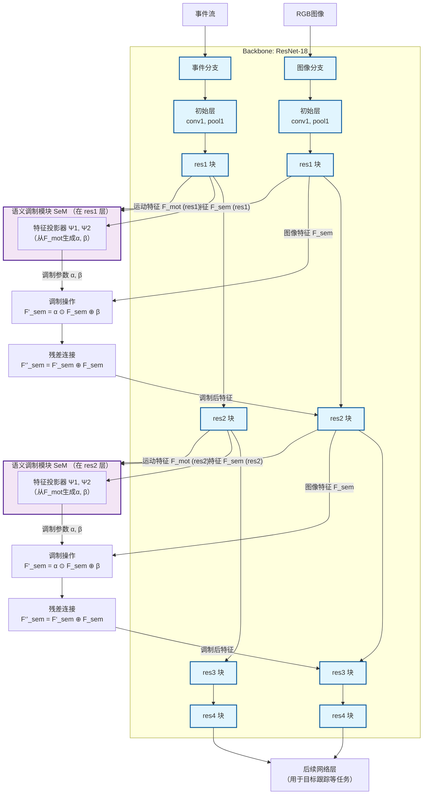
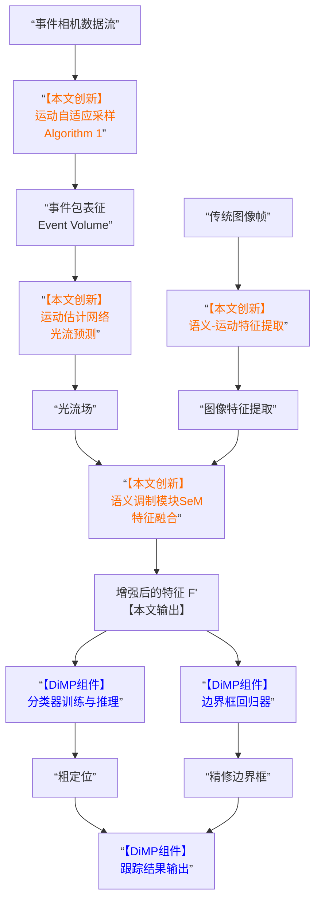
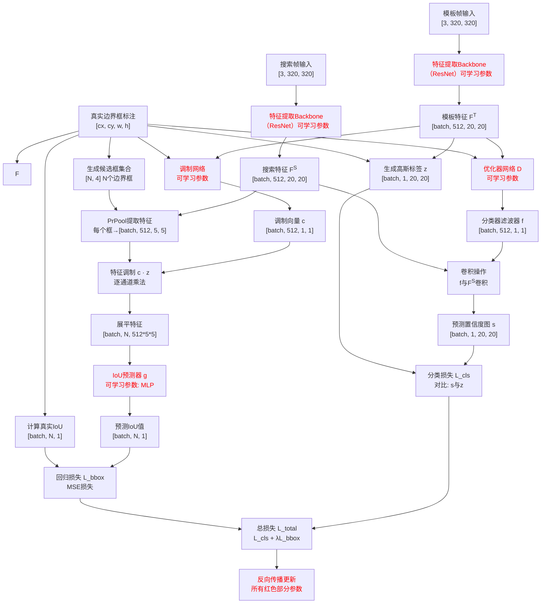
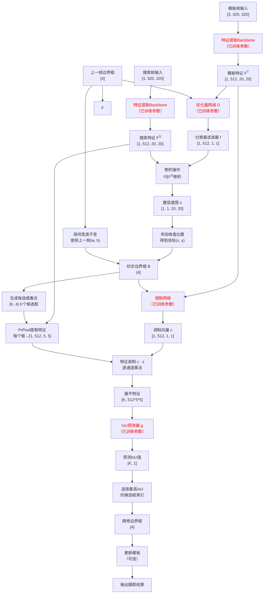

此文主要是放一些文献QA

# CrossEI_Boosting_Motion-Oriented_Object_Tracking_With_an_Event_Camera读后感

---
## 引述部分一些感兴趣的

#### Q1：为什么会需要这个算法Algorithm1，warp(IWE)完以后不就已经是尖锐边缘了嘛，为什么还会出现边缘模糊的问题
> IWE 的理想：IWE的核心思想是“运动补偿”。想象一个场景：一个物体正在移动，它产生的边缘事件在图像上的位置是随时间变化的。如果我能精确知道每个事件发生时，该物体相对于初始时刻的运动（比如一个速度向量），我就可以把所有事件“反向扭曲”回初始时刻的坐标上。这样，属于同一条物体边缘的所有事件就会完美对齐、叠加，形成一条尖锐的线。
IWE 的现实：这个“精确的运动信息”在绝大多数实际应用中是无法直接获得的。​ 我们通常需要从事件数据本身去估计运动。这就成了一个“鸡生蛋蛋生鸡”的问题：为了得到清晰的边缘（IWE），我需要先知道运动；而为了准确估计运动，我又需要清晰的事件数据。

>模糊的真正根源：错误的运动模型与固定时间窗口
当使用的运动信息不准确时，IWE 的效果会大打折扣。但更重要的是，即使不考虑复杂的运动补偿，使用固定时间窗口来生成普通的事件累积图（可以看作一种简单的IWE），也会产生固有的模糊：
快速运动 + 固定时间长窗口：

#### Q2:Introduction中，作者提到了 [7], [8], [9], [10], [11]. [12], [13]这些关于两种相机是基于生物什么结构设计的，可以看看
> pass

#### Q3:B=3是什么意思, 和Algorithm1什么关系
> 没关系,其实B就是时间分桶用于构建张量用的，Algorithm1是负责确定整个事件累积时间区间的大小，至于在这个间隔你想分几桶与它无关。

#### Q4:所以下面这个串联E,F的公式说明了什么，文章利用这个做了什么?
$$\mathcal{E} = \left\{e \doteq (\mathbf{x}, t, p) \mid \ln I(\mathbf{x}, t) - \ln I(\mathbf{x} + \mathbf{w_x}, t) \geq pc\right\}$$
>这个公式说明了:事件发生点\\|(x\\)处对其光流方向点x的"像素亮度差"也有这么个差值在。但这个公式并没有直接显示地转换为光流计算网络\\(F\\)的任何公式,而是一种它网络设计思路的隐式表示。

>比如用事件估算光流并引入帧进损失函数里来评估你的光流计算优劣.思想实质就是这个公式(虽然不是严格的一一转换就是了)

#### 有其他工作利用纯事件用网络估计光流的区别是?即引入光强值进损失函数里面的原因?
>文中解释:原始事件难以代表运动的原因是它们无法意识到自己的起始和终点位置。以绝对光强为参考，事件可以从头到尾倒叙。  
意思可能是说纯事件估计光流的网络能提取光流方向但可能对于大小来说不太精确，如果能给到起始和终点位置的话光流的大小估计会更准确

#### Q5:为什么使用Unet架构而不使用其他?
>首先要知道普通CNN无非就是没有邻接那条线，没有这条线导致在下采样再上采样的过程中会损失掉细节位置的信息，导致可以输出但输出不准确。但Unet作为普通串联CNN的改进版通过并联的方式使得保留了那个精确位置的信息。不会使得CNN末尾部分乱搞来强行拟合结果  
以及残差学习的思想。它确保了调制过程不会破坏原始特征中已经包含的宝贵信息，只是在其基础上进行增强

#### Q6:上采样(反卷积)是怎么实现的
>AI说1.插值然后正常卷积2.零填充然后正常卷积(一定要保证补偿比填充维数高)

#### Q6.5:要在损失函数嵌入\\(I_t(x)\\)的话Unet的输入至少是跟他同尺寸或者还有一个resize需要处理?
>在文章中Unet输出的尺寸与事件本身尺寸相同

#### Q7:\\(sigma\\)是什么,以及为什么不适用一范数二范数
$$
\ell_{\text{photo}}(\bar{\mathbf{w}}; I_t, I_{t+1}) = \sum_{\mathbf{x} \in \Omega} \sigma(I_t(\mathbf{x}) - I_{t+1}(\mathbf{x} + \bar{\mathbf{w}}_\mathbf{x})) \tag{7}
$$
>它不是标准差，而是指 Charbonnier 损失函数，这是一种在计算机视觉，特别是光流、深度估计等稠密预测任务中非常常用的鲁棒损失函数。

>L2 损失（MSE）： L₂(x) = x²  
问题：对异常值（ outliers ）非常敏感。因为误差被平方了，当一个像素的光度误差很大时（比如由于遮挡、反射或噪声），它的损失会变得极大，从而在训练中占据主导地位，把模型参数“拉偏”。  
L1 损失（MAE）： L₁(x) = |x|
优点：比 L2 对异常值更鲁棒。
问题：在误差 x=0处不可导（虽然可以用次梯度解决），且优化动态特性有时不如 L2 平滑。  
Charbonnier 损失（即文中的 σ）： σ(x) = (x² + η²)^r（通常 r=0.5，文中取了0.45）
可以看作是 L1 损失的一个平滑、可微的近似版本。
当 r=0.5时，σ(x) ≈ sqrt(x² + η²) ≈ |x|（当 |x| 较大时），但它在 x=0处却是完全光滑的。
超参数 η 的作用：是一个小的常数，确保函数在原点附近可微，同时避免了除以零等数值不稳定问题。

>直观理解：Charbonnier 损失结合了 L1 和 L2 的优点。对于小的误差，它行为类似 L2，提供平滑的梯度；对于大的误差（可能是异常值），它增长缓慢，行为类似 L1，从而减弱异常值对整体训练的影响

#### Q8:一个模型训练要很久嘛，我想知道一般这个lambda实际跑模型时是怎么确定的遍历吗？
>在计算资源有限但又不是极度紧张的情况下，会进行小规模的搜索：  
通常会尝试2的幂次或数量级变化  
lambda_candidates = [0.05, 0.1, 0.2, 0.4, 0.8]  

>或者每个λ值只训练少量epoch（如完整训练的10-20%）
在验证集上比较性能，选择趋势最好的1-2个值,然后用选出的值进行完整训练 

>或者基于验证集指标的敏感性分析
这是更精细的方法，但需要预先训练一个基础模型：
先用一个合理的λ（如0.2）训练完整模型  
训练完成后，在验证集上计算不同λ值下的损失组件：
固定网络权重，只改变λ重新计算总损失
观察光度损失和平滑度损失随λ变化的趋势
选择能使两个损失达到较好平衡的λ

#### 公式(7)中复合函数怎么对w求梯度
>d[I_{t+1}(x + ŵ_x)] / dŵ_x = ∇I_{t+1}(x + ŵ_x).  
其中∇I是空间梯度;等式右侧表示在x + ŵ_x的帧=t+1的图像空间梯度。  
注:du / dŵ这个雅可比矩阵就是 [[1, 0], [0, 1]]

#### 特征融合的流程图

#### SeM 模块的目的
> SeM 模块的目的是为了让图像特征对运动区域更敏感

#### Q9:DIMP是什么？
>(是一个2019的一个目标跟踪框架)[https://www.bilibili.com/opus/326508018050431252]

#### Q10:在线学习和离线学习的区别?
>离线学习跟踪器（如SiamFC, SiamRPN++）
训练阶段：使用数百万张图像和边界框标注，训练一个通用的相似度匹配网络。  
跟踪阶段：  
用第一帧初始化目标模板  
在后续帧中，用固定的、预训练好的网络计算相似度  
模型参数永远不会改变  
优点：速度快，不需要复杂的在线更新  
缺点：如果目标外观发生训练时没见过的变化，性能会下降  

>在线学习跟踪器（如DiMP, ATOM）  
训练阶段：也进行预训练，但学习的是如何快速适应新目标的能力  
跟踪阶段：  
用第一帧初始化一个专门针对当前目标的分类器  
在每一帧，都用新的观测结果来更新和优化这个分类器  
模型在跟踪过程中不断进化  
优点：对目标变化、遮挡、形变等挑战鲁棒性强  
缺点：计算量更大，需要精心设计更新策略  

#### Q11:对于一张图来说是直接丢给网络的？还是先确定物体所在区域再丢给网络的？如果是后者的话怎么确定物体所在区域？
>1. 对于“模板帧” - 先确定物体区域
对于用来学习“目标长什么样”的模板帧（通常是视频的第一帧），处理方式是先确定物体所在区域。
如何确定？​ 在训练和测试开始时，这个区域是已知的，通常由真实标注（ground truth）提供。这就是公式中出现的 B 
T
 （模板的目标边界框）。
然后怎么做？
根据给定的 B 
T
 ，从模板帧中裁剪出目标区域。这个区域会以 B 
T
 为中心，并包含一定比例的周围背景（上下文信息），共同作为“模板”。
将裁剪出的模板区域输入网络（FENet），得到模板特征 F 
T
 。
所以，对于模板帧，答案是：Yes，先由人工或标注确定物体区域，再处理。

>2. 对于“搜索帧” - 直接丢给网络
对于需要寻找目标的后续帧（搜索帧），处理方式是将整个图像区域（或一个较大的候选区域）直接丢给网络。
为什么？​ 因为我们的目标就是要在这个区域里找到目标，目标的位置正是我们要求解的未知数。
具体过程：
将整张搜索帧（或以上一帧预测位置为中心的一个更大区域）输入网络，得到整个区域的搜索特征 F 
S
 。
然后，利用之前从模板帧学到的“目标信息”（分类器滤波器 f），在搜索特征 F 
S
 上进行卷积操作（公式11: s=F 
S
 ∗f），生成一张响应图（score map）​ s。
响应图上最亮的点（得分最高的位置）就是目标在当前帧中的粗略位置。
所以，对于搜索帧，答案是：Yes，直接将一个大的图像区域丢给网络，让网络自己去里面找。

>3. 边界框回归的精炼
得到粗略位置后，需要精确的边界框。这就是边界框回归器（公式12）的工作：
它以上一步预测的粗略位置为中心，在搜索特征 F 
S
 上提取一个特征块​ z。
然后，结合从模板特征中学习到的调制向量 c，预测当前预测框与真实框的IoU值，从而精修边界框的位置和大小。

#### Q12:(\\(P(F^T, B^T)\\))Prpooling是什么，干什么用的
>PrPooling​ 是 Precise Region of Interest Pooling（精确兴趣区域池化）的缩写。为了理解它，我们最好先了解它要解决的问题以及它的前身。
1. 核心问题：如何从任意形状的框里得到固定大小的特征？
在目标跟踪或检测中：
输入：一张图片的特征图（比如从ResNet中提取的），以及一个边界框（Bounding Box, B^T）。这个框可以是任意大小、任意长宽比。
目标：从这个不规则的框对应的区域中，提取出一个固定大小的特征（比如 6x6），以便后续的全连接层或分类器进行处理。
难点：如何将任意形状的窗口，转换成固定大小的输出？
2. 解决方案的演进：从 RoIPooling 到 RoIAlign 再到 PrPooling
a) 初代方案：RoIPooling（兴趣区域池化）
思想：将目标框划分成 6x6个均匀的格子（bin）。然后对每个格子里的所有特征点进行最大池化，用这个最大值代表这个格子。
缺点：量化误差。在两步操作中会产生严重误差：
将原始框映射到特征图时：特征图大小可能是原图的1/16，坐标除以16后取整，引入第一次误差。
将特征图上的框划分成格子时：格子边界再次取整，引入第二次误差。
后果：特征没有与原始框精确对齐，会轻微“错位”，影响精度。
b) 改进方案：RoIAlign（兴趣区域对齐）
思想：消除量化操作，使用双线性插值来精确定位。
在将目标框映射到特征图上时，不使用取整，保留浮点数坐标。
在每个 6x6的格子中，预先设定几个采样点（比如4个）。
对于每个采样点，根据它周围的4个实际特征点，用双线性插值计算出这个采样点的值。
最后，对这个格子里的几个采样点的值进行池化（最大池化或平均池化），作为这个格子的输出。
优点：极大地减轻了错位问题，特征对齐更精确。这是Mask R-CNN的核心创新之一。

>为什么必须用PrPooling？
因为模板目标框 B^T可以是任意大小。但后续的“优化器网络 D”需要一个固定维度的输入。PrPooling 就像一个智能的适配器，无论来的框是扁的、长的、大的、小的，它都能输出一个标准化的、且与原始框高度对齐的特征块，为后续生成高质量的分类器 f奠定了基础。

#### 为什么需要两个组件？一个不够吗？

#### 实验部分的EF(early Fusion)早期融合,MF(middle Fusion)中期融合
>这是论文用于做消融实验的概念，指将事件相机产生的事件表征（例如，一个3xHxW的事件体积）和对应的传统图像（3xHxW）直接拼接在一起。得到一个多通道的融合数据（例如 6xHxW）。将这个融合后的数据直接送入一个标准的、单模态的跟踪器（如ATOM, DiMP）进行处理。  

>事件数据输入一个Backbone（如ResNet），图像数据输入另一个相同的Backbone。分别得到事件特征 F_event和图像特征 F_image。将这两个特征图在通道维度上进行拼接(不进行本文当中说的“光流融合”)，得到一个融合特征。

#### 为什么测试阶段也需要模板帧的使用?不是已经训练完了吗？
>目标追踪任务与目标识别不同,目标追踪需要在测试视频的第一帧人为框定目标以及其目标框给模型，模型根据这个第一帧作为模板帧一直跟踪这个目标。

>算法效率的区别是,由于目标追踪后续帧根据前一帧的追踪结果框生成附近的框丢尽模型追踪下一帧，因此效率会比目标识别每次都输入整张图像快

#### IOU预测器g的输入和输出是?
>输入是将逐个prpooling的经过滤波器f得到的峰值位置的附近可能的候选框内容(即不是整张图片)。输出是一个预测的IOU值标量(0~1)(表示"这个候选框的质量分数")。指明了哪个候选框是最可能的目标框(物体位置已经被滤波预测在了峰值位置了).所以输出并不是预测框的四维向量！

#### 公式(13)那里\\(s_i\\)是什么,为什么误差函数\\(r\\)要取max?
>\\(s_i\\)指的是完整置信度图s中的单个像素值，每个\\(s_i\\)对应特征图上的一个空间位置.\\(z_c\\)是按照Gt按高斯生成的质信图

>max的目的是为了在背景区域，我们不关心预测值有多小，只关心它不要大于0。负值越大（越负）其实越好，表示模型越确信这是背景。如果对背景区域也使用标准回归损失，背景的损失会主导整个训练过程。取max可以使得当负值损失=0即梯度=0,则不做更新

#### 哪些是本文创新的部分和DIMP原有部分

#### 流程
>训练

> 测试

#### 所以夸张一点地说如果我只需要追踪目标的位置而不要求预测目标框的话我可以不要IOU预测器g不要调制向量生成网络，只要分类器滤波器f是吗？
>是的，理论上可以简化。​ 如果您只关心目标的位置（即中心点坐标），而不需要精确的边界框（宽度和高度），那么可以省略 IoU 预测器 g和调制向量生成网络，只使用分类器滤波器 f来估计目标位置。

#### DAVIS346的输出事件空间分辨率和帧空间分辨率分别是多少
>DAVIS346 的输出事件空间分辨率和帧空间分辨率是相同的，因为它们共享同一个像素阵列。
空间分辨率：346 x 260 像素

#### 指标
>Precision Rate (PR) 可抄用 
精确率曲线：设定一个中心点距离阈值（例如从0到50像素）。对于每一个阈值，计算中心点距离小于该阈值的帧所占的百分比。

> Success Rate (SR)  
成功率曲线：设定一个从0到1变化的IoU阈值。对于每一个阈值，计算数据集中所有视频帧里，IoU大于该阈值的帧所占的百分比。这样会得到一条曲线（横轴是阈值，纵轴是成功率）

>重叠精确率 - Overlap Precision (OPₜ)  
这其实是成功率SR的一个特例。它直接报告在某一个特定的、固定的IoU阈值下的成功率。

#### 数据集
>FE108 偏好高动态范围

>VisEvent 偏好复杂运动

#### 结尾提到了自适应采样的缺陷,是方法本身的问题吗，有办法改善吗?比如说为了得到完整的事件流我某些局部位置可能采样时间间隔会更长而不是像现在的统一的采样时间间隔(自适应只是自适应统一采样时间间隔的大小而已)
>应该不行如果这样的话可能采集到的是重影而不是物体的形状了，本质是相机带通的限制。

>对于小目标的缺陷是因为小目标的自适应采样时间间隔会更长因此